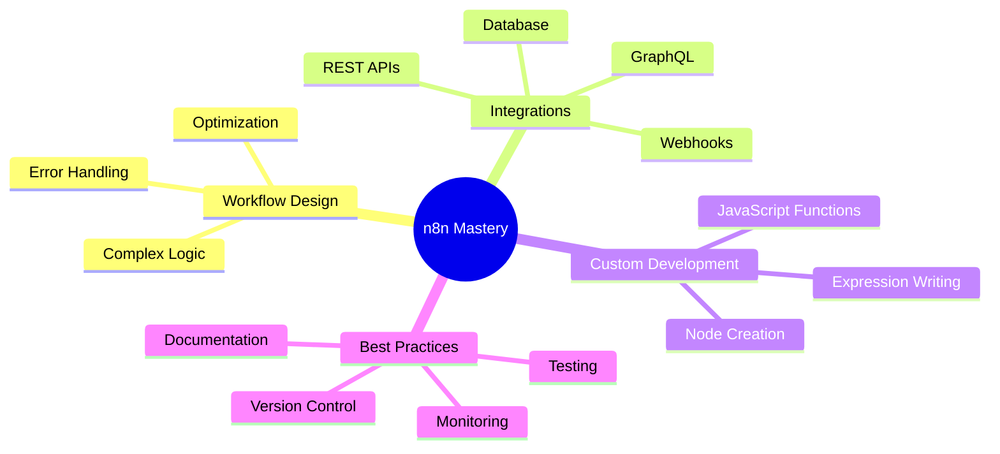

<div align="center">

# 👋 Hey there! I'm urge


[](https://github.com/urge)
[](https://github.com/urge?tab=followers)
[](mailto:urge.github@proton.me)

</div>

---

## 📖 Table of Contents

- [🎯 About Me](#-about-me)
- [🚀 n8n Expertise](#-n8n-expertise)
- [💻 Tech Stack](#-tech-stack)
- [📊 GitHub Stats](#-github-stats)
- [🎨 Featured Projects](#-featured-projects)
- [⚡ Automation Showcases](#-automation-showcases)
- [🛠️ Skills & Tools](#️-skills--tools)
- [🌟 Philosophy](#-philosophy)
- [📫 Connect With Me](#-connect-with-me)

---

## 🎯 About Me

```typescript
const urge = {
    location: "Urge, Estonia 🇪🇪",
    role: "n8n Automation Architect",
    passion: "Building workflows that work while you sleep 😴",
    philosophy: "Automate everything, manually do nothing",
    currentFocus: [
        "Creating powerful n8n automation workflows",
        "Integrating APIs and services seamlessly",
        "Building efficient CI/CD pipelines",
        "Sharing automation knowledge with the community"
    ],
    funFact: "I've automated my coffee breaks ☕"
};
```

---

## 🚀 n8n Expertise

<div align="center">

### What I Do Best

</div>

🔹 **Workflow Design** - Architecting complex multi-step automation workflows  
🔹 **API Integration** - Connecting disparate systems and services  
🔹 **Data Transformation** - Processing and transforming data between platforms  
🔹 **Custom Nodes** - Developing custom n8n nodes for specialized tasks  
🔹 **Webhook Automation** - Building real-time event-driven automations  
🔹 **Database Operations** - Automating CRUD operations and data sync  

<div align="center">

### 🎯 Automation Success Metrics

| Workflows Created | Hours Saved | Integrations Built | APIs Connected |
|:----------------:|:-----------:|:------------------:|:--------------:|
| **150+** 🤖 | **10,000+** ⏱️ | **75+** 🔗 | **200+** 🌐 |

</div>

---

## 💻 Tech Stack

<div align="center">

### Automation & Workflow Tools


### Languages & Frameworks


### Databases & Storage


### DevOps & Cloud


### APIs & Integration


</div>

---

## 📊 GitHub Stats

<div align="center">


</div>

---

## 🎨 Featured Projects

<div align="center">

### 🌟 Automation Workflows Repository
*Coming Soon - A collection of production-ready n8n workflows*

[](https://github.com/urge/urge)

</div>

---

## ⚡ Automation Showcases

<details>
<summary><b>📧 Email to Slack Notification System</b></summary>

**Description:** Automated workflow that monitors specific email accounts and sends formatted notifications to Slack channels  
**Tools Used:** n8n, Gmail API, Slack API, Webhook  
**Impact:** Reduced email checking time by 90%, instant team notifications  
**Key Features:**
- Email filtering and parsing
- Custom message formatting
- Priority-based routing
- Attachment handling
</details>

<details>
<summary><b>🔄 Multi-Platform Content Sync</b></summary>

**Description:** Cross-platform content distribution system  
**Tools Used:** n8n, WordPress, Twitter API, LinkedIn API  
**Impact:** 5x content reach, automated posting  
**Key Features:**
- Scheduled posting
- Image optimization
- Hashtag automation
- Analytics tracking
</details>

<details>
<summary><b>📊 Data Pipeline Automation</b></summary>

**Description:** ETL pipeline for aggregating data from multiple sources  
**Tools Used:** n8n, PostgreSQL, Google Sheets, REST APIs  
**Impact:** Real-time data synchronization across platforms  
**Key Features:**
- Data transformation
- Error handling
- Scheduled batch processing
- Data validation
</details>

<details>
<summary><b>🤖 Customer Onboarding Bot</b></summary>

**Description:** Automated customer onboarding workflow  
**Tools Used:** n8n, CRM API, Email, Calendly  
**Impact:** 80% reduction in manual onboarding tasks  
**Key Features:**
- Welcome email sequences
- Meeting scheduling
- Task assignment
- Progress tracking
</details>

---

## 🛠️ Skills & Tools

<div align="center">



### Proficiency Levels

| Skill | Level | Experience |
|:------|:-----:|:----------:|
| n8n Workflow Development | ████████████ 100% | 3+ years |
| API Integration | ███████████░ 95% | 4+ years |
| JavaScript/TypeScript | ██████████░░ 90% | 5+ years |
| Database Management | █████████░░░ 85% | 3+ years |
| Docker & DevOps | ████████░░░░ 80% | 2+ years |
| Python Automation | ████████░░░░ 75% | 2+ years |

</div>

---

## 🌟 Philosophy

> **"The best automation is the one you don't have to think about."**

<div align="center">

### My Automation Principles

🎯 **Simplicity First** - Keep workflows clean and maintainable  
🔒 **Security Matters** - Never compromise on data protection  
📈 **Scalability** - Build for growth from day one  
📝 **Documentation** - Future you will thank present you  
🧪 **Test Everything** - Automated testing for automation  
🔄 **Iterate & Improve** - Continuous optimization mindset  

</div>

---

## 📫 Connect With Me

<div align="center">

[](mailto:urge.github@proton.me)
[](https://github.com/urge)
[](https://en.wikipedia.org/wiki/Estonia)

### 💬 Let's Talk About

`n8n workflows` • `automation strategies` • `API integrations` • `workflow optimization` • `custom nodes` • `best practices`

---

### ⚡ Quick Stats


**Last Updated:** 2025-11-19 | **Built with** ❤️ **and** ⚡ **automation**

</div>

---

<div align="center">

### 🎉 Thanks for visiting!

*If you find my work interesting, consider giving a ⭐ to my repositories!*

**"Automate the boring stuff, focus on what matters."** 🚀

</div>
