<div align="center">


<p>
  <a href="https://github.com/urge"></a>
  <a href="mailto:urge.github@proton.me"></a>
  
  <a href="https://github.com/urge?tab=followers"></a>
</p>

**📍 Zurich, Switzerland  | 🤖 Automating the Future, One Workflow at a Time**

</div>

---

## 📖 Navigation

<div align="center">

**[🎯 About](#-about-me) • [🚀 Expertise](#-n8n-expertise) • [💻 Stack](#-tech-stack) • [📊 Stats](#-github-stats) • [🏆 Trophies](#-achievements) • [⚡ Projects](#-automation-showcases) • [🛠️ Skills](#%EF%B8%8F-skills--tools) • [📫 Connect](#-connect-with-me)**

</div>

---

## 🎯 About Me

```typescript
const urge = {
  location: "Zurich, Switzerland",
  role: "n8n Automation Architect",
  company: "@urge",
  tagline: "Building workflows that work while you sleep 😴",
  
  expertise: {
    primary: ["n8n", "Workflow Automation", "API Integration"],
    languages: ["JavaScript", "TypeScript", "Python", "Node.js"],
    focus: "Seamless system integration and intelligent automation"
  },
  
  currentlyWorkingOn: [
    "🔧 Building advanced n8n workflow templates",
    "🌐 Creating API integration tutorials",
    "📦 Developing custom n8n community nodes",
    "📚 Documenting automation best practices"
  ],
  
  philosophy: "Automate everything, manually do nothing ⚡",
  funFact: "I've automated my coffee breaks ☕ and my code commits 🤖",
  
  lifeGoal: "Make the world more efficient, one automation at a time 🚀"
};

console.log(`${urge.tagline} - Let's automate! 🎉`);
```

<div align="center">

### 🎯 Quick Stats

| 🤖 Workflows | ⏱️ Hours Saved | 🔗 Integrations | 🌐 APIs |
|:---:|:---:|:---:|:---:|
| **50+** | **5,000+** | **30+** | **75+** |

</div>

---

## 🚀 n8n Expertise

<div align="center">

### 💡 What I Do Best

</div>

<table>
<tr>
<td width="50%">

**🔹 Workflow Design**
- Complex multi-step automation
- Error handling & retry logic
- Conditional branching
- Loop optimization

**🔹 API Integration**
- REST & GraphQL APIs
- OAuth authentication
- Webhook automation
- Rate limiting strategies

**🔹 Data Transformation**
- JSON manipulation
- Data mapping & filtering
- Format conversion
- Data enrichment

</td>
<td width="50%">

**🔹 Custom Development**
- Custom n8n nodes
- JavaScript expressions
- Function nodes
- Code snippets

**🔹 Database Operations**
- CRUD automation
- Data synchronization
- Batch processing
- Query optimization

**🔹 Real-time Automation**
- Event-driven workflows
- Instant notifications
- Live data sync
- Trigger-based actions

</td>
</tr>
</table>

---

## 💻 Tech Stack

<div align="center">

### 🤖 Automation & Workflow


### 💻 Languages & Frameworks


### 🗄️ Databases & Storage


### ☁️ DevOps & Cloud


### 🔌 APIs & Integration


### 🛠️ Tools & Platforms


</div>

---

## 📊 GitHub Stats

<div align="center">

<picture>
  <source
    srcset="https://github-readme-stats.vercel.app/api?username=urge&show_icons=true&theme=synthwave&include_all_commits=true&count_private=true&hide_border=true&bg_color=0d1117&title_color=ea4aff&icon_color=ea4aff&text_color=c9d1d9&rank_icon=github"
    media="(prefers-color-scheme: dark)"
  />
  <source
    srcset="https://github-readme-stats.vercel.app/api?username=urge&show_icons=true&theme=default&include_all_commits=true&count_private=true"
    media="(prefers-color-scheme: light), (prefers-color-scheme: no-preference)"
  />
  
</picture>

<picture>
  <source
    srcset="https://github-readme-stats.vercel.app/api/top-langs/?username=urge&layout=compact&theme=synthwave&hide_border=true&bg_color=0d1117&title_color=ea4aff&text_color=c9d1d9&langs_count=8"
    media="(prefers-color-scheme: dark)"
  />
  <source
    srcset="https://github-readme-stats.vercel.app/api/top-langs/?username=urge&layout=compact&theme=default&langs_count=8"
    media="(prefers-color-scheme: light), (prefers-color-scheme: no-preference)"
  />
  
</picture>

</div>

<div align="center">

<picture>
  <source
    srcset="https://github-readme-streak-stats.herokuapp.com/?user=urge&theme=synthwave&hide_border=true&background=0d1117&ring=ea4aff&fire=ea4aff&currStreakLabel=ea4aff"
    media="(prefers-color-scheme: dark)"
  />
  <source
    srcset="https://github-readme-streak-stats.herokuapp.com/?user=urge&theme=default"
    media="(prefers-color-scheme: light), (prefers-color-scheme: no-preference)"
  />
  
</picture>

</div>

<div align="center">

### 📈 Contribution Graph

<picture>
  <source>
    
  </source>
  <source>
    
  </source>
  
</picture>

</div>

---

## 🏆 Achievements

<div align="center">

<picture>
  <source
    srcset="https://github-profile-trophy.vercel.app/?username=urge&theme=discord&no-frame=true&no-bg=true&column=4&margin-w=15&margin-h=15"
    media="(prefers-color-scheme: dark)"
  />
  <source
    srcset="https://github-profile-trophy.vercel.app/?username=urge&theme=flat&no-frame=true&column=4&margin-w=15&margin-h=15"
    media="(prefers-color-scheme: light), (prefers-color-scheme: no-preference)"
  />
  
</picture>

### 🐍 Contribution Snake

<picture>
  <source media="(prefers-color-scheme: dark)" srcset="https://raw.githubusercontent.com/urge/urge/output/github-contribution-grid-snake-dark.svg">
  <source media="(prefers-color-scheme: light)" srcset="https://raw.githubusercontent.com/urge/urge/output/github-contribution-grid-snake.svg">
  
</picture>

</div>

---

## ⚡ Automation Showcases

<div align="center">

### 🎨 Featured Workflows & Projects

</div>

<details open>
<summary><b>📧 Email-to-Slack Notification System</b></summary>

<br/>

**🎯 Challenge:** Team missing important emails buried in inboxes  
**💡 Solution:** Real-time email monitoring with intelligent Slack routing

**🔧 Tech Stack:**
- n8n workflow engine
- Gmail API integration
- Slack Webhooks
- Custom filtering logic

**✨ Key Features:**
- ✅ Smart email filtering by sender, subject, and keywords
- ✅ Priority-based channel routing
- ✅ Formatted message templates with action buttons
- ✅ Attachment handling and file uploads
- ✅ Thread management for related emails

**📊 Impact:**
- 🚀 90% reduction in email response time
- ⚡ Instant team notifications
- 📈 Zero missed critical communications

</details>

<details>
<summary><b>🔄 Multi-Platform Content Distributor</b></summary>

<br/>

**🎯 Challenge:** Manual posting to multiple social platforms  
**💡 Solution:** Unified content management with automated distribution

**🔧 Tech Stack:**
- n8n workflow automation
- Twitter/X API
- LinkedIn API
- Medium API
- Image optimization tools

**✨ Key Features:**
- ✅ Single-source content creation
- ✅ Platform-specific formatting
- ✅ Scheduled multi-platform posting
- ✅ Automatic hashtag generation
- ✅ Analytics aggregation

**📊 Impact:**
- 🚀 5x content reach increase
- ⏱️ 80% time savings
- 📈 Consistent posting schedule

</details>

<details>
<summary><b>📊 ETL Data Pipeline Automation</b></summary>

<br/>

**🎯 Challenge:** Manual data aggregation from multiple sources  
**💡 Solution:** Automated ETL pipeline with real-time sync

**🔧 Tech Stack:**
- n8n for orchestration
- PostgreSQL database
- Google Sheets integration
- REST APIs
- Data validation rules

**✨ Key Features:**
- ✅ Multi-source data extraction
- ✅ Advanced data transformation
- ✅ Error handling & logging
- ✅ Incremental updates
- ✅ Data quality checks

**📊 Impact:**
- 🚀 Real-time data synchronization
- ⚡ 95% error reduction
- 📈 Scalable architecture

</details>

<details>
<summary><b>🤖 Automated Customer Onboarding</b></summary>

<br/>

**🎯 Challenge:** Time-consuming manual onboarding process  
**💡 Solution:** End-to-end automated onboarding workflow

**🔧 Tech Stack:**
- n8n automation platform
- CRM API integration
- Email service provider
- Calendly scheduling
- Document generation

**✨ Key Features:**
- ✅ Welcome email sequences
- ✅ Automatic meeting scheduling
- ✅ Resource distribution
- ✅ Progress tracking
- ✅ Personalized experience

**📊 Impact:**
- 🚀 80% reduction in onboarding time
- ⚡ 100% process consistency
- 📈 Improved customer satisfaction

</details>

---

## 🛠️ Skills & Tools

```mermaid
mindmap
  root((🤖 n8n<br/>Mastery))
    🎨 Workflow Design
      Complex Logic
      Error Handling
      Optimization
      Scalability
    🔌 Integrations
      REST APIs
      GraphQL
      Webhooks
      Database Ops
      OAuth Flow
    💻 Custom Dev
      Node Creation
      JavaScript
      TypeScript
      Expression Writing
    📋 Best Practices
      Version Control
      Documentation
      Testing
      Monitoring
      Security
    🚀 Automation
      Event Driven
      Scheduled Jobs
      Real-time Sync
      Batch Processing
```

<div align="center">



</div>

<div align="center">

### 📊 Skill Proficiency

| Skill | Proficiency | Experience | Projects |
|:------|:----------:|:----------:|:--------:|
| **n8n Workflow Development** |  | 2+ years | 50+ |
| **API Integration** |  | 3+ years | 75+ |
| **JavaScript/TypeScript** |  | 4+ years | 100+ |
| **Database Management** |  | 2+ years | 30+ |
| **Docker & DevOps** |  | 1+ year | 20+ |
| **Python Automation** |  | 1+ year | 15+ |

</div>

---

## 🌟 Philosophy & Principles

<div align="center">

> ### _"The best automation is the one you don't have to think about."_
> **— urge**

</div>

<table>
<tr>
<td width="50%">

### 🎯 Core Principles

**🔹 Simplicity First**  
Keep workflows clean, readable, and maintainable for future you

**🔹 Security Always**  
Never compromise on data protection and access control

**🔹 Built to Scale**  
Design for growth from day one, optimize for performance

</td>
<td width="50%">

### 💡 Development Values

**🔹 Document Everything**  
Clear documentation saves hours of debugging later

**🔹 Test Thoroughly**  
Automated testing for automation workflows

**🔹 Iterate & Improve**  
Continuous optimization and refinement mindset

</td>
</tr>
</table>

---

## 📫 Connect With Me

<div align="center">

### 💬 Let's Talk About

`n8n workflows` • `automation strategies` • `API integrations` • `workflow optimization` • `custom nodes` • `best practices` • `efficiency hacks`

<br/>

<a href="mailto:urge.github@proton.me">
  
</a>
<a href="https://github.com/urge">
  
</a>
<a href="https://en.wikipedia.org/wiki/urich">
  
</a>

<br/><br/>

### ☕ Support My Work

If you find my automation workflows and tools helpful, consider supporting my work!

<a href="https://github.com/sponsors/urge">
  
</a>
<a href="https://www.buymeacoffee.com/urge">
  
</a>

<br/><br/>

### 📊 Profile Analytics


**🕒 Last Updated:** `2025-11-19 08:03:42 UTC`  
**🛠️ Built with:** ❤️ **love**, ⚡ **automation**, and **endless coffee** ☕

</div>

---

<div align="center">


### 🎉 Thanks for Visiting!

_**If you find my work interesting, consider giving a ⭐ to my repositories!**_

<br/>

**💡 "Automate the boring stuff, focus on what matters."** 🚀

<br/>

 <em><b>I love connecting with different people</b> so if you want to say <b>hi, I'll be happy to meet you more!</b> 😊</em>

</div>

---
